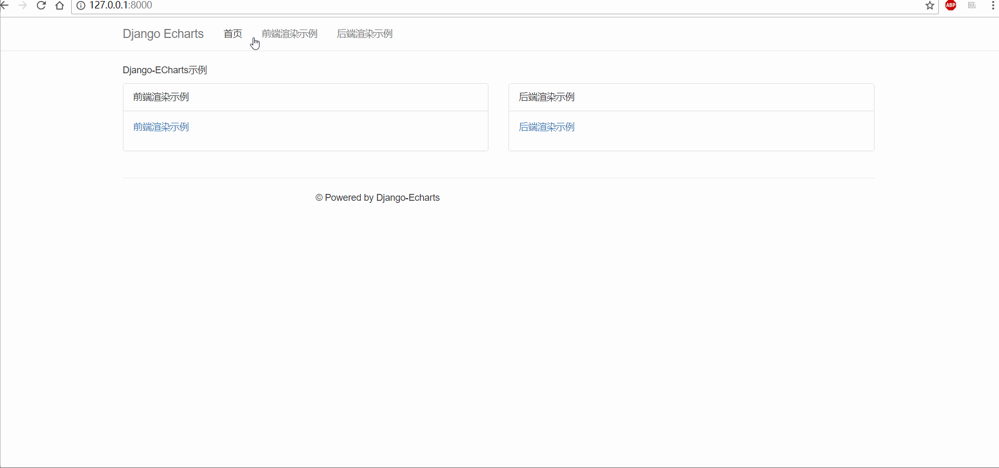

# django-echarts

 [](https://travis-ci.org/kinegratii/django-echarts)   

django-echarts is a [Django](https://www.djangoproject.com) app for [Echarts](http://echarts.baidu.com/index.html) integration using [pyecharts](https://github.com/pyecharts/pyecharts) as chart builder.

## Overview

django-echarts provides these features:

- Frontend and backend views
- A javascript file manager
- Data builder library
- A CLI based on django command

## Installation

### Python3 Only

django-echarts only support Python 3.5+ and Django 2.0+.

```shell
pip install django-echarts
```

Or use source code

```shell
git clone https://github.com/kinegratii/django-echarts.git
cd django-echarts
python setup.py install
```

### Other Dependencies

pyecharts requires 0.3+:

- pyecharts>=0.3.0


## Quickstart

1 Add django_echarts to the `INSTALL_APPS` list in the settings module file.

```python
INSTALL_APPS = (
    # Your apps
    'django_echarts',
    # Your apps
)
```

2 Custom your settings with `DJANGO_ECHARTS` variable in the settings module.e.g

```python
DJANGO_ECHARTS = {
    'echarts_version': '4.0.4',
    'lib_js_host':'cdnjs'
}
```

3 Add views, urls.

```python

from pyecharts import Bar
from django_echarts.views.backend import EChartsBackendView

class BackendEChartsTemplate(EChartsBackendView):
    template_name = 'backend_charts.html'

    def get_echarts_instance(self, *args, **kwargs):
        bar = Bar("我的第一个图表", "这里是副标题")
        bar.add("服装", ["衬衫", "羊毛衫", "雪纺衫", "裤子", "高跟鞋", "袜子"], [5, 20, 36, 10, 75, 90])
        return bar
```

4 Write template files.

```html




    <div class="row row-offcanvas row-offcanvas-right">
        <div class="col-xs-6 col-sm-2 sidebar-offcanvas" id="sidebar">
            <div class="list-group">
                <a href="?name=bar" class="list-group-item">柱形图(Bar)</a>
                <a href="?name=kine" class="list-group-item">K线图(KLine)</a>
                <a href="?name=map" class="list-group-item">地图(Map)</a>
                <a href="?name=pie" class="list-group-item">饼图(Pie)</a>
            </div>
        </div>
        <!--/.sidebar-offcanvas-->
        <div class="col-xs-12 col-sm-10">
            <p class="pull-right visible-xs">
                <button type="button" class="btn btn-primary btn-xs" data-toggle="offcanvas">Toggle nav</button>
            </p>
            {# 渲染容器 #}
            

        </div>
        <!--/.col-xs-12.col-sm-9-->
    </div>




    {# 渲染依赖文件 #}
    
    {# 渲染初始化文本 #}
    

```

## Document

[Online Document](http://django-echarts.readthedocs.io/zh_CN/latest/index.html)

## Demo

The example project is under example directory

```shell
cd example
python manage.py runserver 127.0.0.1:8000
```

Access the web url http://127.0.0.1:8000 , the screencut is the following picture.



## License

This project is under the MIT license, Issues & Pull requests are welcome.
