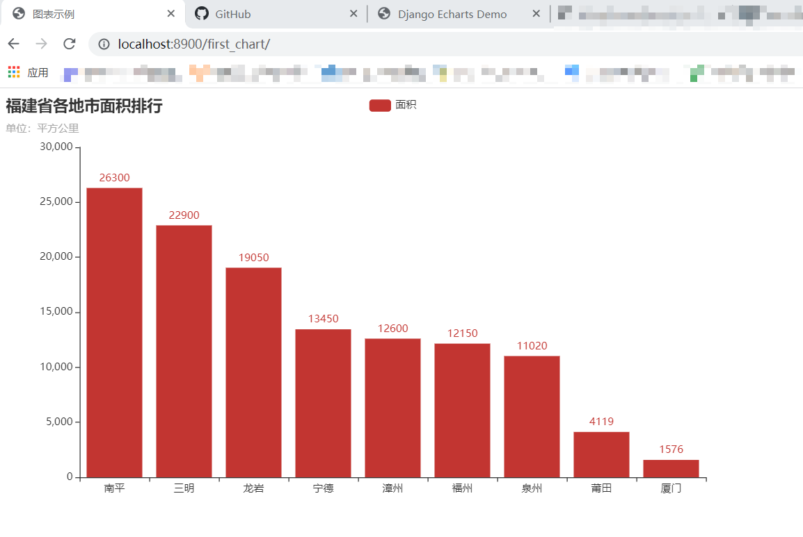

# django-echarts

 [](https://travis-ci.org/kinegratii/django-echarts)   


django-echarts 是一个 [pyecharts](https://github.com/pyecharts/pyecharts) +  [Django](https://www.djangoproject.com) 整合的 Django App。

## 概述

django-echarts 主要提供了以下的内容：

- **“前端渲染”** / **后端渲染** 两种不同的渲染方式
- 基于 Django Template Engine 的模板标签库
- js/css静态文件托管
- 数据构建工具函数库
- 项目级的CLI工具

## 安装

### pyecharts

请根据你的 pyecharts 版本安装 django-echarts 。

| django-echarts版本系列 | pyecharts | django | python | 备注 |
| ------ | ------ | ------ | ----- | ----- |
| 0.5.x | 1.9+ | 2.0+ | 3.7+ | 开发中 |

> django-echarts v0.3.x 不再维护。

### 安装方式

可以使用 pip 在线安装。

```shell
pip install django-echarts
```

## 快速使用

1 添加 django_echarts包到项目配置模块的 `INSTALL_APPS`列表。

```python
INSTALL_APPS = (
    # Your apps
    'django_echarts',
    # Your apps
)
```

2 编写视图函数，继承 `django_echarts.views.SimpleChartBDView` ，重写 `get_echarts_instance` 方法返回图表对象。

```python
from django_echarts.views import SimpleChartBDView
from pyecharts.charts import Bar
from pyecharts import options as opts

class MyFistBackendChartsTemplateView(SimpleChartBDView):
    page_title = '图表示例'

    def get_echarts_instance(self, *args, **kwargs):
        bar = Bar().add_xaxis(["南平", "三明", "龙岩", "宁德", "漳州", "福州", "泉州", "莆田", "厦门"]).add_yaxis(
            '面积', [26300, 22900, 19050, 13450, 12600, 12150, 11020, 4119, 1576]
        ).set_global_opts(
            title_opts=opts.TitleOpts(title="福建省各地市面积排行", subtitle="单位：平方公里"))
        bar.renderer = 'svg'
        return bar
```

3 编写路由规则。

```python
from django.conf.urls import url

urlpatterns = [
    url(r'^first_chart/$', views.MyFistBackendChartsTemplateView.as_view()),
]
```

4 启动开发服务器，打开浏览器预览结果。

```shell
python manage.py runserver 0.0.0.0:8900
```


预览图




## 文档

[在线文档](http://django-echarts.readthedocs.io/zh_CN/latest/index.html)

## 示例

示例项目位于 example 文件夹。

第一步，安装依赖

```shell
cd example
pip install -r requirements.txt
```

第二步，启动项目开发服务器

```shell
python manage.py runserver 127.0.0.1:8000
```

访问本地地址： http://127.0.0.1:8000 ，示例运行结果

## 开源协议

项目基于 MIT开源协议，欢迎提交 Issue & Pull request 。
