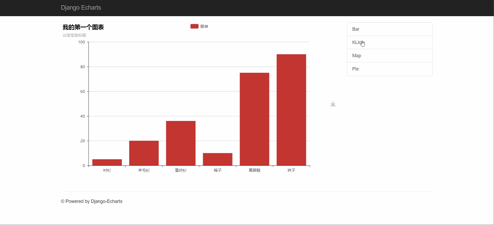

# django-echarts

   

基于 [chenjiandongx/pyecharts](https://github.com/chenjiandongx/pyecharts) 的 [Echarts](http://echarts.baidu.com/index.html)和 [Django](https://www.djangoproject.com) 的整合库。

> 目前该项目还处于开发状态(Alpha)，不建议在生产环境中使用。

## 概述

django-echarts提供了一系列用于整合的功能。主要有：

- 数据构建工具
- 基于前端或后端的数据渲染
- js静态文件管理
- 常用的命令工具

django-echarts使用到了Django常用部件，在使用之前应当对其有所了解。包括：

- 项目配置(Settings)
- 视图类(Class-Based View)
- 模板标签(Template Tag)
- 上下文处理器(Context Processor)
- 管理命令(Manage Command)

## 安装

django-echarts的安装要求为：

- Python2.7+或者3.5+
- Django 1.8+

可以从pypi安装

```
pip install django-echarts
```

或者使用源码构建

```
git clone https://github.com/kinegratii/django-echarts.git
cd django-echarts
python setup.py install
```

## 快速使用

1 添加 django_echarts包到项目配置模块的 `INSTALL_APPS`列表。

```python
INSTALL_APPS = (
    # Your apps
    'django_echarts'
    # Your apps
)
```

2 根据实际场景需要设置一些配置参数，这些参数必须定义在项目模块中一个名为 `DJANGO_ECHARTS` 的字典里。

```python
DJANGO_ECHARTS = {
    'lib_js_host':'cdnjs'
}
```

或者全部采用默认值。

3 根据渲染方式（前端或者后端方式）编写视图类，模板页面和路由。

前端渲染方式

```python
def create_simple_bar():
    bar = Bar("我的第一个图表", "这里是副标题")
    bar.add("服装", ["衬衫", "羊毛衫", "雪纺衫", "裤子", "高跟鞋", "袜子"], [5, 20, 36, 10, 75, 90])
    return bar


class SimpleBarView(EChartsFrontView):
    def get_echarts_instance(self, **kwargs):
        return create_simple_bar()
      
```

后端渲染方式

```python
 class BackendEChartsTemplate(EChartsBackendView):
    template_name = 'backend_charts.html'

    def get_echarts_instance(self, *args, **kwargs):
        return create_simple_bar()
```


## 文档

- [English Document](docs/us-en/api.md)
- [中文文档](docs/zh-cn/api.md)

## 示例

示例项目请参考 example 文件夹。

```shell
cd example
python manage.py runserver 127.0.0.1:8000
```

访问本地地址： http://127.0.0.1:8000 ，示例运行结果



## 开源协议

项目基于 MIT开源协议，欢迎提交 Issue & Pull request 。