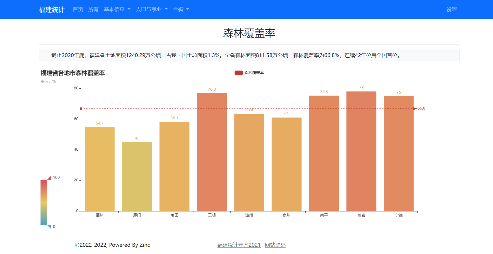
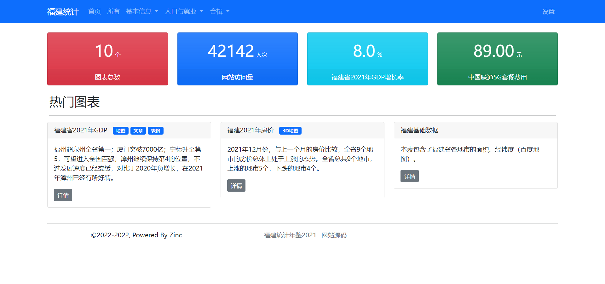
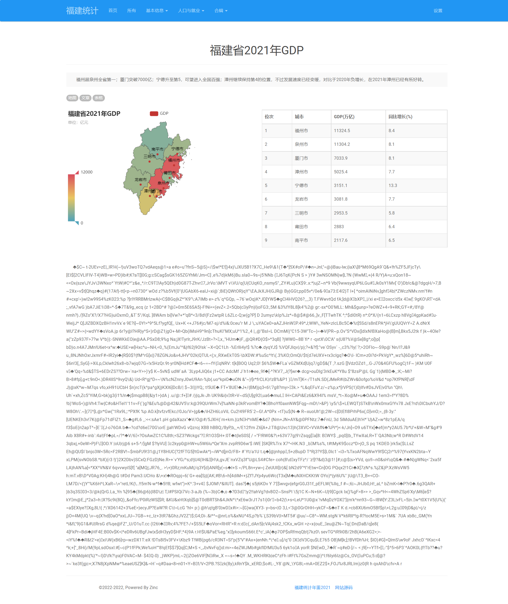

# django-echarts

   [](https://github.com/kinegratii/django-echarts/actions/workflows/unittest.yaml) [](https://codecov.io/gh/kinegratii/django-echarts)


> A visual site scaffold based on pyecharts and django.

django-echarts 是一个基于[pyecharts](https://github.com/pyecharts/pyecharts) 和 [Django](https://www.djangoproject.com) 整合的可视化网站脚手架。

## 概述(Summary)

django-echarts 主要提供了以下的内容：

- 支持 90%+的pyecharts图表类型
- 页面：主页 / 列表 / 详情 / 关于 / 设置 
- 组件：导航栏 / 网站底部栏 / 热门板块 / 列表 / 合辑 /  关于面板 
- UI主题：Bootstrap3 / Bootstrap5 / Material ，支持更换颜色模式
- 可灵活扩展: 支持整合 Django用户认证 / 数据库 / Session 
- 基于Django Template Engine 的后端渲染
- js/css静态文件托管，支持在线/本地切换
- 生产力工具：代码生成器 / 静态文件下载器
- 90%+ Python Typing Hints覆盖
- 单元测试和85%+代码覆盖率

## 安装(Install)

django-echarts的运行环境要求如下：

| django-echarts版本系列 | pyecharts & echarts | django | python |
| ------ | ------ | ----- | ----- |
| 0.6.x | 1.9 / 4.8.0 | 2.0 - 4.1 | 3.7+ |
|  | 2.0 / 5.4.1 | 2.0 - 4.1 | 3.7+ |
| 0.5.x | 1.9 | 2.0 - 4.0 | 3.7+ |

可以使用 pip 命令安装。

```shell
pip install django-echarts
```

在 *requirements.txt* 引用 django-charts时，推荐使用 **固定次版本号** 的方式。

```
django-echarts~=0.6
```

## 3分钟上手(Quickstart in 3 Minutes)

**1.** 创建Django项目。

```shell
django-admin startproject MyDemo
```

项目目录结构如下：

```text
MyDemo
  |-- MyDemo
        |-- __init__.py
        |-- asgi.py
        |-- settings.py
        |-- urls.py
        |-- site_views.py
        |-- wsgi.py
  |-- manage.py
```

**2.** 添加 django_echarts包和对应的主题包到项目配置模块的 `INSTALL_APPS`列表。

```python
INSTALL_APPS = (
    # Your apps
    'django_echarts',
    'django_echarts.contrib.bootstrap5'
    # Your apps
)
```

**3.** 创建新文件 *site_views.py* ，输入下列代码。

```python
# ...
from django_echarts.starter.sites import DJESite
from django_echarts.entities import Copyright
from pyecharts import options as opts
from pyecharts.charts import Bar

site_obj = DJESite(site_title='福建统计')

site_obj.add_widgets(copyright_=Copyright(start_year=2022, powered_by='Zinc'))

chart_description = '截止2020年底，福建省土地面积1240.29万公顷，占我国国土总面积1.3%。全省森林面积811.58万公顷，森林覆盖率为66.8%，连续42年位居全国首位。

@site_obj.register_chart(title='森林覆盖率', description = chart_description, catalog='基本信息')
def fujian_forest_coverage():
    bar = Bar().add_xaxis(
        ['福州', '厦门', '莆田', '三明', '漳州', '泉州', '南平', '龙岩', '宁德']
    ).add_yaxis(
        '森林覆盖率', [54.7, 45, 58.1, 76.8, 63.4, 61, 75.3, 78, 75]
    ).set_global_opts(
        title_opts=opts.TitleOpts(title="福建省各地市森林覆盖率", subtitle="单位：%"),
        visualmap_opts=opts.VisualMapOpts(is_show=True, max_=100, min_=0)).set_series_opts(
        markline_opts=opts.MarkLineOpts(
            data=[
                opts.MarkLineItem(y=66.8, name="全省"),
            ]
        )
    )
    return bar
```

在函数`fujian_forest_coverage` 中编写pycharts代码，返回对应的图表对象。

根据需要修改文字显示，添加组件等。

**4.** 在项目的路由模块 *urls.py* 添加挂载点。


```python
from django.conf.urls import url, include
from django.urls import path

from .site_views import site_obj

urlpatterns = [
    # Your urls
    path('', include(site_obj.urls))
]
```

**5.** 启动开发服务器，打开浏览器预览结果。

```text
python manage.py runserver 0.0.0.0:8900
```

运行效果（下图已添加其他组件）



## 文档(Document)

[在线文档](https://django-echarts.readthedocs.io/)

Build on [Material for MkDocs](https://squidfunk.github.io/mkdocs-material/)

## 示例项目(Demo Project)

在线示例 [https://zinc.pythonanywhere.com](https://zinc.pythonanywhere.com) 

参见项目 [kinegratii/zinc](https://github.com/kinegratii/zinc) 。

## 截图(Screen Shots)

**Home with ValuesPanel (bootstrap5)**



**Chart Detail Page (bootstrap3.paper)**




## 开源协议(License)

MIT License
