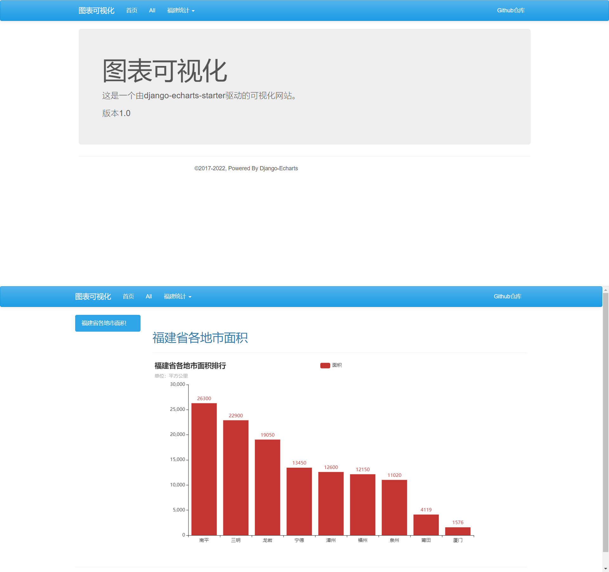

# django-echarts文档

   


> A visual site generator based on [pyecharts](https://github.com/pyecharts/pyecharts) and [Django](https://www.djangoproject.com). 

## 概述

django-echarts 是一个基于[pyecharts](https://github.com/pyecharts/pyecharts) 和 [Django](https://www.djangoproject.com) 整合的可视化网站生成器。

- 支持 90%+的pyecharts图表类型
- 可显示页面：主页 / 列表 / 详情 / 关于
- 可支持组件：导航栏 / 网站底部栏 / 热门板块 / 列表 / 关于面板 
- UI主题：Bootstrap3 / Bootstrap5 / Material ，支持更换颜色模式
- 可灵活扩展: 支持整合 Django用户认证 / 数据库 / Session 
- 基于Django Template Engine 的后端渲染
- js/css静态文件托管，支持在线/本地切换
- 生产力工具：代码生成器 / 静态文件下载器
- 90%+ Python Typing Hints覆盖

## 安装

django-echarts包运行环境要求如下：

| django-echarts版本系列 | pyecharts | django | python | 备注 |
| ------ | ------ | ------ | ----- | ----- |
| 0.5.x | 1.9+ | 2.0+ | 3.7+ | 开发维护中 |

可以使用 pip 命令安装。

```shell
pip install django-echarts
```

## 3分钟上手

1 创建Django项目。

```shell
django-admin startproject MyDemo
```

项目目录结构如下：

```text
MyDemo
  |-- MyDemo
        |-- __init__.py
        |-- asgi.py
        |-- settings.py
        |-- urls.py
        |-- site_views.py
        |-- wsgi.py
  |-- manage.py
```

2 添加 django_echarts包到项目配置模块的 `INSTALL_APPS`列表。

```python
INSTALL_APPS = (
    # Your apps
    'django_echarts',
    # Your apps
)
```

3 进入项目目录，执行 *startsite* 命令 ，生成对应的代码基本框架。

````text
python manage.py startsite MyDemo\site_views.py --site-title "EchartsDemo"
````

*site_views.py* 文件代码如下： 

```python
"""
The file is generated by django-echarts 0.5.0b1.
Now you can add site urls to the entry urlpatterns in project urls.py.
Example:
    urlpatterns = [
        # Other urlpatterns
        path('', site_obj.urls),
    ]

"""
from django_echarts.starter.widgets import Copyright
from django_echarts.starter.sites import DJESite

__all__ = ['site_obj']

site_obj = DJESite(site_title='图表可视化')

site_obj.add_widgets(copyright_=Copyright(start_year=2022, powered_by='Django-Echarts'))


@site_obj.register_chart
def mychart():
    # Write your pyecharts here.
    # This method must return an object of pycharts.charts.Chart
    pass


```

4在函数`mychart` 中编写pycharts代码，返回对应的图表对象。

根据需要修改文字显示，添加组件等。

```python
from pyecharts import options as opts
from pyecharts.charts import Bar, Kline, Map, Pie, WordCloud

site_obj = DJESite(
    site_title='图表可视化',
    copyright_=Copyright(start_year=2017, powered_by='Django-Echarts'),
    theme='bootstrap3.cerulean'
)

site_obj.add_widgets(
    jumbotron=Jumbotron('图表可视化', main_text='这是一个由django-echarts-starter驱动的可视化网站。', small_text='版本1.0'),
)
site_obj.add_link(LinkItem(text='Github仓库', url='https://github.com/kinegratii/django-echarts', new_page=True))

@site_obj.register_chart(name='c1', title='福建省各地市面积', description='福建省各地市面积排行', catalog='福建统计')
def mychart():
    bar = Bar().add_xaxis(["南平", "三明", "龙岩", "宁德", "漳州", "福州", "泉州", "莆田", "厦门"]).add_yaxis(
        '面积', [26300, 22900, 19050, 13450, 12600, 12150, 11020, 4119, 1576]
    ).set_global_opts(
        title_opts=opts.TitleOpts(title="福建省各地市面积排行", subtitle="单位：平方公里"))
    return bar
```

5 在项目的路由模块 *urls.py* 添加挂载点。


```python
from django.conf.urls import url, include
from django.urls import path

from .site_views import site_obj

urlpatterns = [
    # Your urls
    path('', include(site_obj.urls))
]
```

6 启动开发服务器，打开浏览器预览结果。

```text
python manage.py runserver 0.0.0.0:8900
```


预览图



