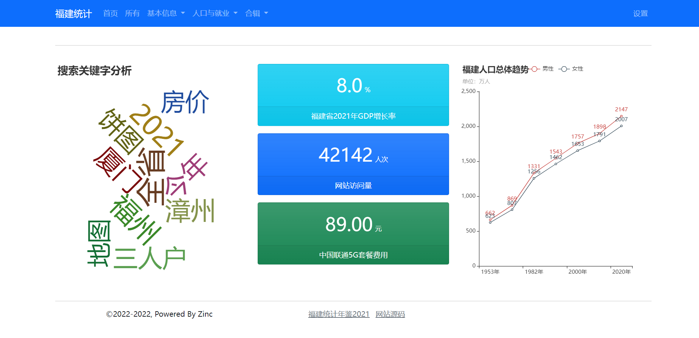

# 组件和布局

## 概述

### 组件体系

django-echarts 定义了一套较为完整、可扩展的组件体系，主要组件包括：

| 组件                                   | 数据层         |                  | 渲染层                                           |
| -------------------------------------- | -------------- | ---------------- | ------------------------------------------------ |
|                                        | **名称**       | **说明**         | **标签函数<sup>1</sup>、模板文件 <sup>2</sup> ** |
| **echarts图表**                        |                |                  |                                                  |
| pycharts.charts.base.Base <sup>3</sup> | echarts图表    | width / height   | -                                                |
| prettytable.PrettlyTable               | 表格           |                  | -                                                |
| pycharts.charts.Table                  | 表格           |                  | -                                                |
| **HTML组件**                           |                |                  |                                                  |
| HTMLBase                               | HTML组件基础类 | 不可实例化       |                                                  |
| ChartInfo                              | 信息卡         |                  | widgets/chart_info.html                          |
| Copyright                              | 版权栏         |                  | widgets/copyright.html                           |
| LinkItem / Menu                        | 菜单项/链接    | context / class_ | -                                                |
| ValueItem                              | 数字卡片       |                  | value_item.html                                  |
| **容器组件**                           |                |                  |                                                  |
| ContainerBase                          | 容器基础类     | 不可实例化       |                                                  |
| RowContainer                           | 行容器         |                  | widgets/row_container.html                       |
| NamedCharts                            | 多图表         |                  | widgets/row_container.html <sup>4</sup>          |
| ValuesPanel                            | 数值面板       |                  | widgets/row_container.html                       |
| Container                              | 页面容器       |                  | widgets/container.html                           |
| WidgetCollection                       | 合辑           |                  | -                                                |

1. 渲染标签函数均使用 `dw_widget` ，原有的具体组件渲染函数 echarts_container/dw_table等不再推荐使用。
1. 未指定模板文件的组件其渲染方式和具体的css框架无关，或者需要由用户传入样式类名称，如 Table。
2. `pyecharts.charts.base.Base` 类的图表，主要包括 Bar、Line、Grid、TimeLine等。
4. `NamedCharts` 和 `ValuesPanel` 渲染逻辑同 `RowContainer`，可以使用 `RowContainer` 代替。


### 模板渲染

在模板中所有组件均可使用 *dw_widget* 渲染，其他参数使用关键字方式传入参数。

```

{% dw_widget chart2 width="100%" %}
```

## 图表组件

### echarts图表

> pycharts.charts.base.Base

Base 组件在创建和配置方面请参考 [pyecharts 文档](https://pyecharts.org/)。

**Geojson地图**

django-echarts 扩展支持原生 geojson 数据，详情可参见文章  [《Geojson地图》](/posts/use_custom_geojson)。

**自定义元素尺寸**

同一echarts图在不同页面以不同的尺寸展示，在模板文件中指定图表div元素的宽度和高度。

```html
{% dw_widget chart_obj width="100%" height="800px" %}
```


### 表格(PrettyTable)

> pyecharts.charts.Table
>
> prettytable.PrettyTable
>
> django_echarts.entities.bootstrap_table_css(border=False, borderless=False, striped=False, size=None)
>
> django_echarts.entities.maiterial_table_css(striped=False, center=False)
>
> django_echarts.conf.DJANGO_ECHART_SETTINGS.theme_manger.table_class(border=False, borderless=False, striped=False, size=None)

**定义**

表格数据的创建和添加操作参见 pyecharts 或 prettytable 文档。

```python
from pyecharts.charts import Table
from django_echarts.entities import bootstrap_table_css

table = Table()
fields = ['位次', '城市', 'GDP(万亿)', '同比增长(%)']
gdp2021 = [
    [1, '福州市', 11324.5, 8.4], [2, '泉州市', 11304.2, 8.1],
    [3, '厦门市', 7033.9, 8.1], [4, '漳州市', 5025.4, 7.7],
    [5, '宁德市', 3151.1, 13.3], [6, '龙岩市', 3081.8, 7.7],
    [7, '三明市', 2953.5, 5.8], [8, '莆田市', 2883, 6.4],
    [9, '南平市', 2117.6, 6.5]
]
table.add(
    fields, gdp2021,
    attributes={'class': bootstrap_table_css(border=True, striped=True)}
)
```

**表格css**

和其他组件不同的是，表格的css类必须在实例中先行定义。其中 `ThemeManager.table_css` 获取的是当前主题的css类。

| 参数       | bootstrap 3/5          | Material         | 描述     |
| ---------- | ---------------------- | ---------------- | -------- |
| 默认       | table table-responsive | responsive-table | 响应式   |
| border     | table-bordered         | -                | 边框     |
| borderless | table-borderless       | -                | 无边框   |
| striped    | table-striped          | striped          | 阴影交叉 |
| size       | table-sm / table-md    | -                | 大小     |
| center     | -                      | centered         | 居中     |

## HTML组件

### 数字仪盘(ValuesItem)

```python
ValueItem(value: Any, description: str, unit: str = None, catalog: str = 'primary', trend: Literal['up', 'down', ''] = '')
```

以突出方式显示数字数值。

| 参数          | 类型                      | 描述             |
| ------------- | ------------------------- | ---------------- |
| **ValueItem** |                           |                  |
| value         | Any                       | 数值型数据       |
| description   | str                       | 描述性文字       |
| unit          | str                       | 单位文字         |
| catalog       | str                       | 决定背景颜色     |
| arrow         | Literal['up', 'down', ''] | 数字后的箭头符号 |

例子：

```python
@site_obj.register_html_widget
def home1_panel():
    rc = RowContainer()
    # 显示图表总个数
    rc.add_widget(ValueItem(str(site_obj.chart_info_manager.count()), '图表总数', '个', catalog='danger'))
    rc.add_widget(ValueItem('42142', '网站访问量', '人次'))
    return rc
```

### 大标题组件(Jumbotron)

`Jumbotron` 是大标题组件的数据类。

```python
site_obj.add_widgets(
    jumbotron=Jumbotron('图表可视化', main_text='这是一个由django-echarts-starter驱动的可视化网站。', small_text='版本1.0'),
)
```

可设置下列参数：

| 参数       | 类型 | 描述     |
| ---------- | ---- | -------- |
| title      | str  | 主标题   |
| main_text  | str  | 主要文字 |
| small_text | str  | 小文字   |

### 底部版权栏(Copyright)

`Copyright` 类用于初始化页面底部的版权文字。可以传入的参数有：

| 参数       | 类型 | 描述         |
| ---------- | ---- | ------------ |
| start_year | int  | 开始的年份   |
| powered_by | str  | 版权主题名称 |

例子 `Copyright(start_year=2017, powered_by='Django-Echarts')` 的将渲染为下列文字：

```
©2017-2022, Powered By Django-Echarts
```

## 容器组件

### 容器接口(ContainerBase)

```text
ContainerBase
    |-- Container
        |-- WidgetCollection
    |-- RowContainer
        |-- NamedCharts
        |-- ValuesPanel
```

`ContainerBase` 是一个通用的容器基础类，一般直接使用其子类 `container` 或 `RowContainer`，成员属性如下：

| 属性      | 类型                 | 描述               | Container | RowContainer        |
| --------- | -------------------- | ------------------ | --------- | ------------------- |
| _widgets  | OrderedDict          | 子组件列表         | 可用      | 可用                |
| _layouts  | Dict[str, LayoutCfg] | 每个组件的布局参数 | 无效      | 有效                |
| div_class | str                  | HTML元素class值    | 可自定义  | 不可更改，默认为row |

`ContainerBase` 既是布局上的容器，也是数据结构上的容器。

| 方法、函数      | 描述                   |
| --------------- | ---------------------- |
| len(container)  | 子组件数量             |
| list[container] | 迭代遍历子组件         |
| container[3]    | 获取第3个子组件        |
| container['c3'] | 获取名称为'c3'的子组件 |

### 添加组件

> ContainerBase.add_widget(widget, name: str = None, width: str = "", height: str = "", span: int = 0, first:bool=False)

add_widget函数接受下列参数：

| 参数   | 类型 | 描述                                                         |
| ------ | ---- | ------------------------------------------------------------ |
| widget | Any  | 所有在 `renders.render_widget` 注册的图表组件、HTML组件和容器，可嵌套。 |
| name   | str  | 名称，如不提供默认为 'c1'、‘c2’等格式                        |
| width  | str  | 组件宽度，默认将调整 `pyecharts.charts.Base`图表类为 '100%'。 |
| height | str  | 组件高度。如有设置，优先使用此值，而不是 `widget.height`。   |
| span   | int  | 样式类 `col-md-{span} col-sm-12` ，默认span=0表示平均分配。  |
| offset | int  | 如果大于0则添加 `col-md-offset-{offset}` 样式类              |
| first  | bool | 添加到最后还是前面，默认添加到后面。                         |

### 通用容器(Container)

> Container(*args, div_class: str = '', **kwargs)

通用容器，其元素样式须由使用者自行制定。`add_widget` 仅支持widget / name / first 三个参数。。

```python
page_container = Container(div_class='container-fluid')
row1 = RowContainer()
row2 = RowContainer()
page_container.add_widget(row1)
page_container.add_widget(row2)
```

渲染后如下

```html
<div class="container-fluid">
    <div class="row">...</div>
    <div class="row">...</div>
</div>
```


### 行布局容器(RowContainer)

> RowContainer(*args, **kwargs)

`RowContainer` 用于表示 bootstrap/material 框架的row容器，一行有12列，支持嵌套。

### 多图表(NamedCharts)

> class NamedCharts(page_title: str = 'EChart', is_combine: bool = False)

NamedCharts 是一个包括多个图表的容器类，继承自 `RowContainer` 类。

```python
ncharts = NamedCharts(page_title='复合图表')
pie = Pie()
ncharts.add_chart(pie, 'pie')
bar = Bar()
ncharts.add_chart(bar, 'bar')
bar2 = Bar()
ncharts.add_chart(bar2) # 默认分配 'c{n}' 作为名称，此项为 'c2'
```

构造函数参数：

| 参数       | 类型 | 描述     |
| ---------- | ---- | -------- |
| page_title | str  | 标题     |
| is_combine | bool | 是否引用 |

### 数值面板(ValuesPanel)

该类已不再推荐使用，直接使用其父类 `RowContainer` 即可。原有的 `add` 函数可以使用 `add_widget` 代替。

```python
vp = ValuesPanel()
vp.add('8.0', '福建省2021年GDP增长率', '%', catalog='info')

# 与上述逻辑相同
rc = RowContainer()
rc.add_widget(ValueItem('8.0', '福建省2021年GDP增长率', '%', catalog='info'))
```


## 布局

### 设置方法

有三种设置布局的方法：

**方法一. 单独设置**

逻辑如下：

- 如果 `add_widget` 同时指定一个大于0的span值，则该组件占用span列；
- 其余 span等于0的组件平均占用剩下的空间；
- 特别的，如果 `add_widget` 均未指定任何 span ，即每个组件的span均为0，则按一行12列平均分布各组件。

如

```python
rc = RowContainer()
rc.add_widget(w1, span=5)

rc2 = RowContainer()
rc2.add_widget(n1, span=12)
rc2.add_widget(n2, span=12)
rc.add_widget(rc2, span=2)

rc.add_widget(w2, span=5)
```

则布局渲染如下

```html
<div class="row">
    <div class="col-md-5 col-sm-12">...</div>
    <div class="col-md-2 col-sm-12">
        <div class="row">
            <div class="col-md-12 col-sm-12">...</div>
            <div class="col-md-12 col-sm-12">...</div>
        </div>
    </div>
    <div class="col-md-5 col-sm-12">...</div>
</div>
```

**方法二. 统一设置**

在添加完所有组件后，调用 `set_spans` 设置。

```python
rc = RowContianer()
rc.add_widget(w1)
rc.add_widget(w2)

rc.set_spans([4, 8]) # 4列，8列
rc.set_spans(6) # 每行2个组件
rc.set_spans(12) # 每行1个组件
```

### 示例

下面是一个嵌套各种组件的布局：

```python
rc = RowContainer()  # 外层rc容器未指定任何span值，以4,4,4显示3个组件
c1 = factory.get_widget_by_name('search_word_cloud')
rc.add_widget(c1)

rc2 = RowContainer()
ni = ValueItem('8.0', '福建省2021年GDP增长率', '%', catalog='info')
rc2.add_widget(ni)
ni2 = ValueItem('42142', '网站访问量', '人次')
rc2.add_widget(ni2)
ni3 = ValueItem('89.00', '中国联通5G套餐费用', '元', catalog='success')
rc2.add_widget(ni3)
rc2.set_spans(span=12)  # 每个组件均以12列显示，即垂直方式

rc.add_widget(rc2)
c2 = factory.get_widget_by_name('fj_total_population')
rc.add_widget(c2)
```

模板文件中相关布局只需定义如下：

```html


```


效果图



## 自定义组件

django-echarts 提供了创建新的自定义组件的方法。

**创建组件类**

创建组件类。继承自 `HTMLBase` 。

```python
class SolarDateWidget(HTMLBase):
    def __init__(self, day:date):
        self.day = day
```

**模板文件**

模板文件位置位于 *widgets/{widget_name}.html* 。这里是 *widgets/solar_date_widget.html* 。（类名称的蛇形命名形式）

```html
<div>
    {{ widget.day.year}}年{{ widget.day.month }}月{{ widget.day.day }}日
</div>
```

